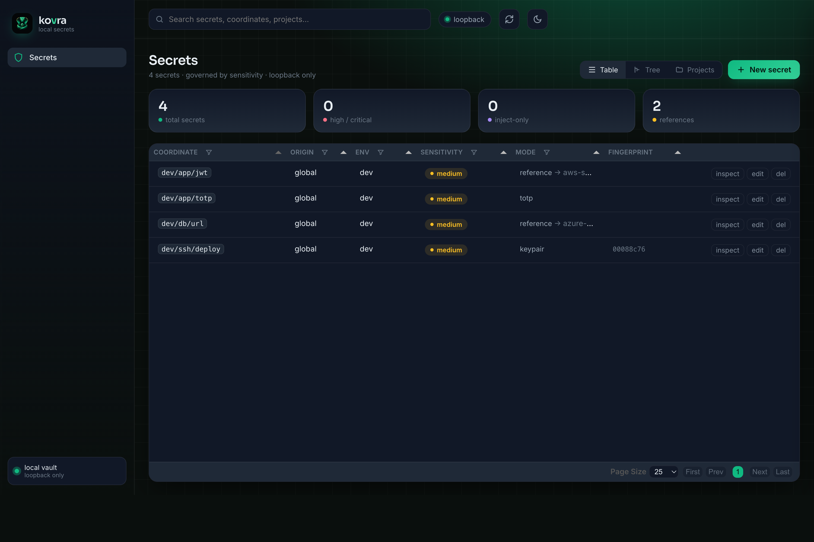

import { Tabs, TabItem } from '@astrojs/starlight/components';

Para cuando prefieras hacer clic en lugar de escribir, kovra incluye una pequeña
**interfaz web de administración**. Es **bajo demanda y solo en loopback** — no es un daemon,
no está expuesta a la red y está gobernada por exactamente la misma [política](/es/security/decision/)
que la CLI y los agentes.



## Iniciarla

`kovra ui` te pide que hagas <span class="bioprove">bioProve</span> para abrirla (abrir una superficie de administración es en sí misma una acción protegida), luego enlaza solo
`127.0.0.1`, genera un **token de sesión efímero** y abre tu navegador:

<Tabs syncKey="os">
<TabItem label="macOS">

```ansi frame="terminal" title="zsh" {1}
~ % kovra ui
kovra ui → http://127.0.0.1:8731/?session=0bd48b80…
(loopback only; ephemeral session; auto-shutdown after 300s idle or Ctrl-C)
```

</TabItem>
<TabItem label="Windows">

<p class="os-soon"><strong>Windows — próximamente.</strong> El mismo modelo sobre Windows Hello + Credential Manager.</p>

</TabItem>
</Tabs>

Se cierra con Ctrl-C o tras un tiempo de inactividad (`--idle`, 300 s por defecto). Flags
útiles: `--no-open` (solo imprime la URL), `--port`, y `--no-confirm` (omite la compuerta
de inicio para dev/CI/Docker; también `KOVRA_UI_NO_CONFIRM`).

## Qué muestra — y qué no

La interfaz visualiza tu vault por [sensibilidad](/es/concepts/sensitivity/): coordenadas,
niveles, modos, proyectos y metadatos. Fundamentalmente, **nunca renderiza el texto plano
de un secreto `high` o `inject-only`** — estos se muestran enmascarados, y la única forma
de revelarlos es un `kovra show` deliberado en la terminal. La misma barrera que protege
a un agente protege la página: una pestaña del navegador es simplemente otra superficie, y
la política la trata como tal.

## Ejecutarla en Docker

¿Prefieres un contenedor? `kovra ui --docker` ejecuta la interfaz web desde una imagen
`kovra-ui` publicada — Docker la descarga en el primer uso, así que no hay nada que compilar
localmente:

```bash
kovra ui --docker
```

Mantiene las mismas garantías que la interfaz nativa: la clave maestra llega al contenedor
solo como un **Docker secret en tmpfs** (nunca incorporada en una capa de imagen),
`~/.vaults` se monta con lectura y escritura, y el puerto se publica **solo en loopback**.
El inicio sigue estando protegido por un <span class="bioprove">bioProve</span> a menos que
pases `--no-confirm`. Requiere Docker corriendo en el host.
